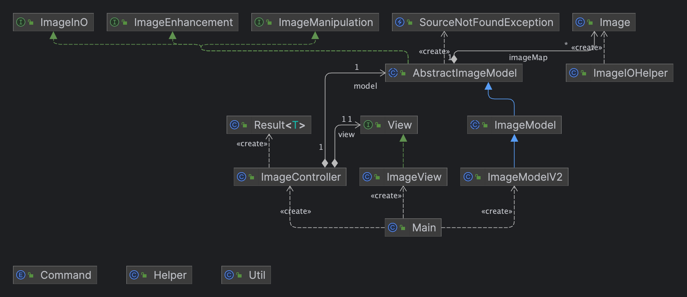
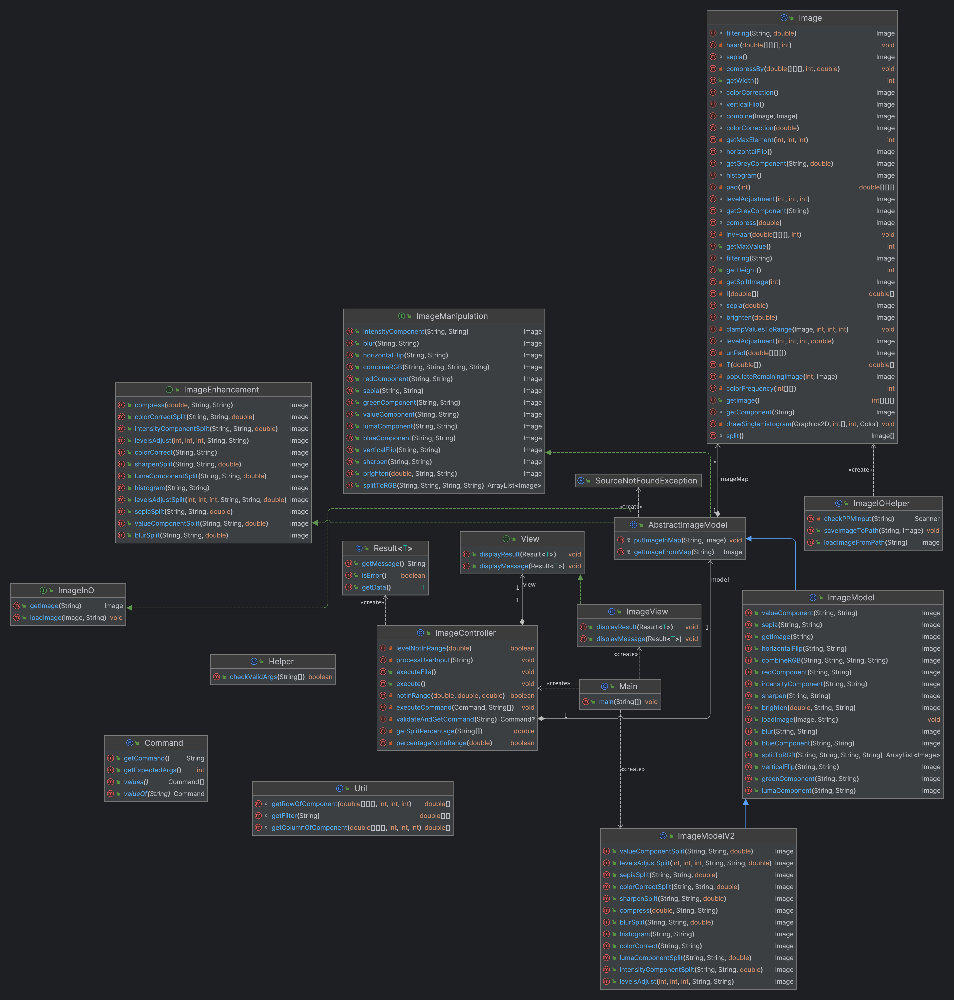

# IME: Image Manipulation and Enhancement

This is an image processing application with text-based user interaction.

## Table of Contents

- [Introduction](#introduction)
- [Features](#features)
- [Design](#design)
- [Design Changes](#design-changes)
- [Citation](#citation)

## Introduction

This project focuses on building an image processing application with text-based user interfaces.
The program allows users to manipulate images using various operations and provides support for
common image file formats such as ASCII PPM, JPG, JPEG and PNG.

## Features

- Loading and saving images in ASCII PPM, JPG, JPEG and PNG formats
- Visualizing individual R, G, and B components of an image
- Flipping images horizontally and vertically
- Brightening and darkening images
- Splitting a single image into three channels (R, G, B)
- Combining three grayscale images into a single color image
- Blurring and sharpening images
- Converting images to sepia tone

## Design

This application follows the Model-View-Controller (MVC) architectural pattern to ensure a clear
separation of concerns and maintain a well-structured codebase. The use of MVC allows for easy
management and modification of the application components without affecting the entire system.

**MODEL**

The model layer consists of the various classes responsible for handling image data and processing
operations.

- `Image`: Represents an image with properties like width, height, pixel data. The pixel data and
  color components are represented as a 3D array (RGB format). This class handles core image
  manipulations algorithms which are used by `ImageModel` class.

- `ImageInO`: Provides the necessary methods for loading and saving images internally from different
  file formats, including ASCII PPM, JPG, and PNG.

- `ImageManipulation`: Defines the methods for image processing operations such as flipping,
  brightening, blurring, sharpening, and color transformations.

- `ImageEnhancement`: Defines the methods for image enhancement operations such as histogram,
  color correct, level adjustments and some image manipulations operations with split functionality.
  It also defines functions to compress images.

- `AbstractImageModel`: Serves as an abstract class that implements the `ImageInO`
  and `ImageManipulation` interfaces. It provides a common implementation for shared functionalities
  across various image processing operations and file management tasks.

- `ImageModel`: Abstract implementation of `AbstractImageModel` which provided implementations for
  various image manipulations and file management functionalities. This class saves images after
  various operations within the program and read and writes images to the file system.

- `ImageModelV2`: Concrete implementation of `ImageModel` which inherits implementations for
  various image manipulations and file management functionalities. This class implements methods in
  ImageEnhancement.

**VIEW**

`View`: Defines the methods for displaying results, images and messages, which is an essential 
part of the View component in the MVC pattern.

`ImageView`: This class implements the `View` interface, providing methods to display results and
messages. It displays success and error messages in this text-based environment.

`ImageGraphicalView`: This class implements the GUI for the image processing application. It uses 
java swing for the user interface.

**CONTROLLER**

`ImageController`: It acts as the controller, facilitating communication between the model and the
view. It processes user commands, interacts with the image processing functionality, and handles
errors appropriately.

`ImageGUIController`: This is a controller for the GUI implemented but ImageGraphicalView class. 
It handles user clicks in the UI and display the UI accordingly.

## Design changes

Made all the methods in ImageModel final and the class abstract. This is done to maintain the
existing functionality as is. Now as a new version ImageModelV2 class is created which extends this
abstracted ImageModel and adds the new features in this class which are required in Assignment 5.

For Assignment 6, a new controller ImageGUIController is introduced which handles all the inputs 
from the UI. For the GUI java swing is used and all the code related to the view reside in 
ImageGraphicalView class.

## Citation

Author: Jovana Askrabic (https://unsplash.com/@jovana0909)

Source: https://unsplash.com/photos/black-white-and-brown-bernese-mountain-dog-lying-on-green-grass-field-during-daytime-4QQQTTXn3NA

License or Usage Terms: https://unsplash.com/license